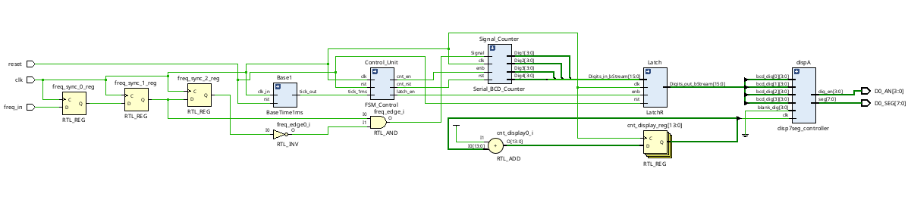
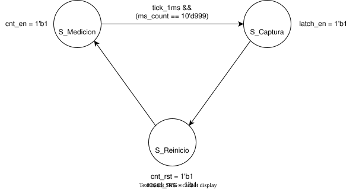
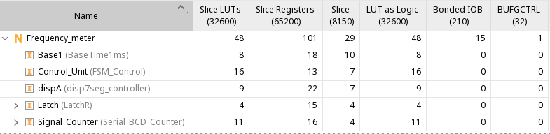

Frecuencímetro

# Introducción

En el informe se detalla el diseño e implementación en hardware de un frecuencímetro digital basado en medición directa. El sistema fue desarrollado utilizando el lenguaje de descripción de hardware SystemVerilog y diseñado para ser implementado sobre la plataforma de desarrollo FPGA Boolean Board (Xilinx Spartan-7). El objetivo principal del sistema es muestrear una señal digital externa de frecuencia desconocida y visualizar su valor en hercios (Hz) a través de los displays de 7 segmentos integrados en la placa.

# Arquitectura del Diseño

### Decisiones de diseño

Para modelar este frecuencímetro se utilizó una arquitectura estrictamente síncrona donde todo el sistema es manejado por el clock de 100MHz de la Boolean Board.  
El muestreo se lleva a cabo en ventanas de 1s, el mismo controlado por el módulo de “Control\_Unit”, encargado de interpretar los pulsos de 1ms que provienen del modulo de “Base1” y coordinar el funcionamiento del resto de módulos.  
Para la deteccíon de la frecuencia, se identifican los flancos provenientes de la señal incógnita, para luego pasar por una serie de contadores BCD conectados de manera serial. Esto nos facilita la codificación de los datos a la hora de traducirlos a un display de 7 segmentos.

### Unidad de control y máquina de estados

La “Control\_Unit”, modelada como máquina de estados, se encarga de multiplexar los estados de medición, captura y reinicio en la ventana de tiempo dada. Esta utiliza y cuenta los ticks de 1ms recibidos por el módulo de “Base1” para determinar una ventana de 1s.

**Estados implementados:**

**S_MEDICION:** Habilita el conteo (`cnt_en = 1`). El sistema acumula los flancos detectados de la señal externa. Una vez que el contador interno de milisegundos alcanza los 999 (equivalente a 1 segundo), transita al estado de captura.

**S_CAPTURA:** Detiene el conteo (`cnt_en = 0`) y emite un pulso de un ciclo de reloj (`latch_en = 1`). Esto ordena al banco de flip-flops guardar el valor final alcanzado por los contadores BCD. Transita automáticamente en el siguiente ciclo de reloj.

**S_REINICIO:** Emite una señal de borrado síncrono (`cnt_rst = 1` y `reset_ms = 1`) que limpia los contadores BCD y el temporizador interno para prepararlos para la siguiente ventana de medición. Vuelve a `S_MEDICION` inmediatamente.

Los valores de las señales en los estados donde no aparecen se corresponden a “0”

## Resultados y Síntesis

El diseño fue sintetizado e implementado exitosamente en la FPGA Boolean Board. Para la validación empírica, se conectó la salida de un generador de funciones externo al pin configurado como `freq_in`, asegurando que la amplitud lógica estuviera comprendida entre 0V y 3.3V.  
**Valores tomados:**

- Se inyectaron señales de 4.5690 kHz y se logró graficar el valor de “4569” en el display.

- Se Utilizó el boton de reset para reiniciar el muestreo y se reseteó exitosamente llevando el conteo a 0 para luego volver al valor de la muestra.

### Coste Espacial

## Conclusión

Desarrollar este frecuenciómetro nos ayuda a dimensionar el cambio entre ambos paradigmas. Pasamos del software, donde utilizamos el código para ejecutar instrucciones generalmente secuenciales, al hardware, donde la herramienta se utiliza para llevar a cabo una descripción comportamental del sistema y sus módulos. Adentrarnos en el paradigma del hardware, que es inherentemente paralelo, nos obliga a rever y repensar los métodos y las formas en las cuales diseñamos nuestro sistema.

